# Deploy Application on Ec2 Using Httpd as Web-Server using user data

***

**HTTPd stands for Hypertext Transfer Protocol daemon. 
It usually is the main software part of an HTTP server better known as a web serverSome commonly used implementations are: Apache HTTP Server**

## LAB

### Step1: Create EC2 Instance

***

**open aws console and search for EC2 service and once the page displayed click on launch instance as shown below**

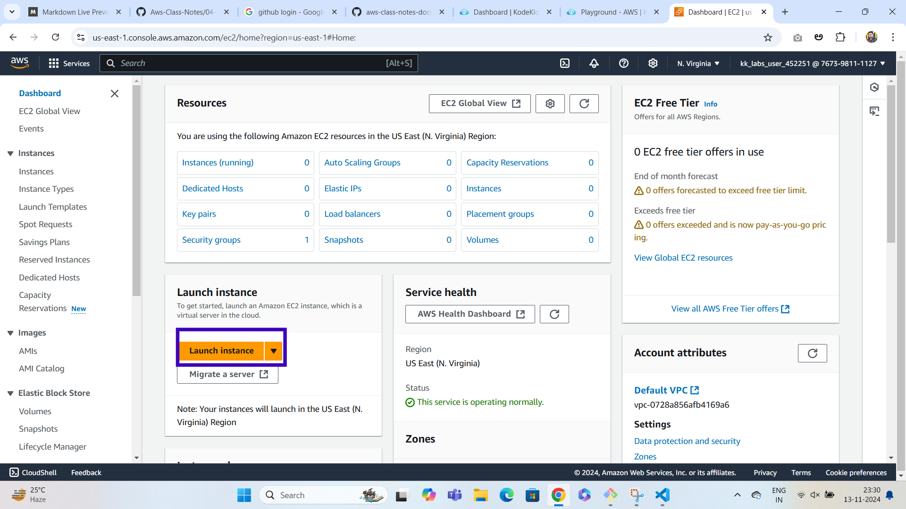

**once the launch an instance page is displayed give a name for ec2 and also select ami as shown below**

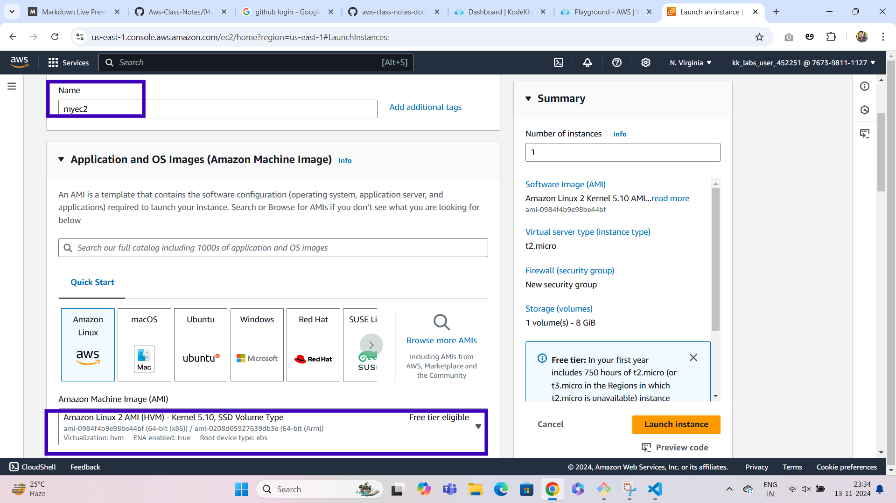

**select instance type as t2.micro and click on create new keypair button as shown below**

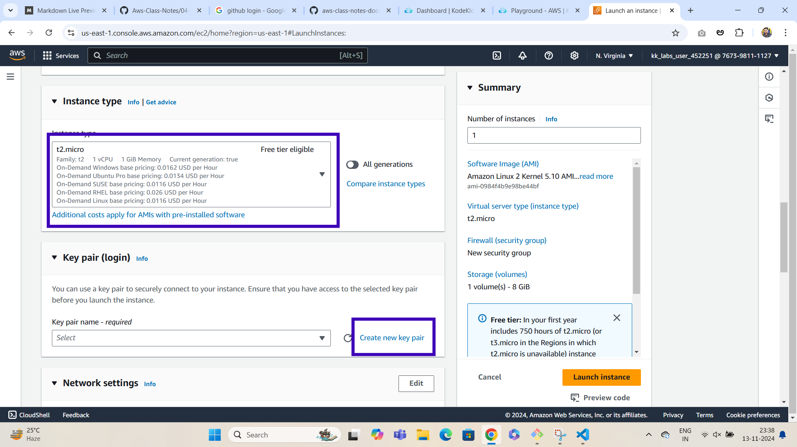

**After clicking on create new keypair select the options as shown below and click on create keypair button**

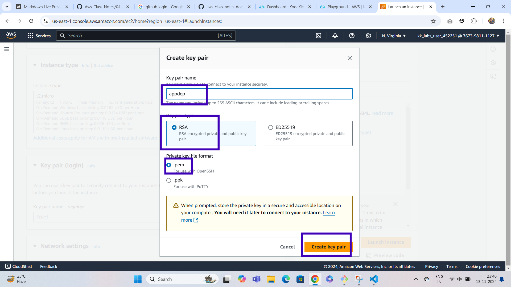

**After creating keypair go to network settings and click on edit button**

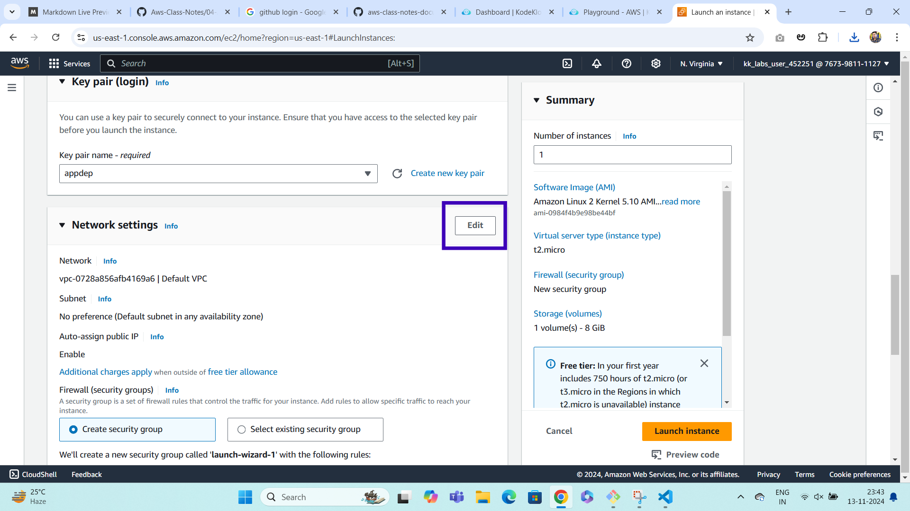

**click on add security group rule and select http as shown below**
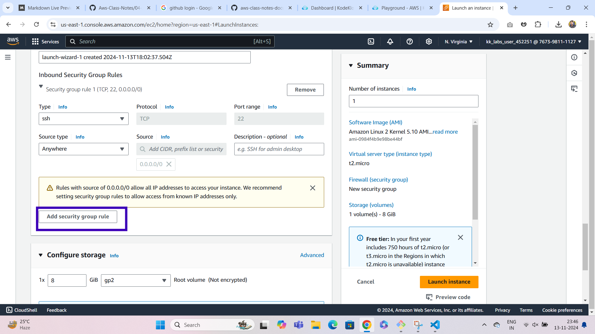

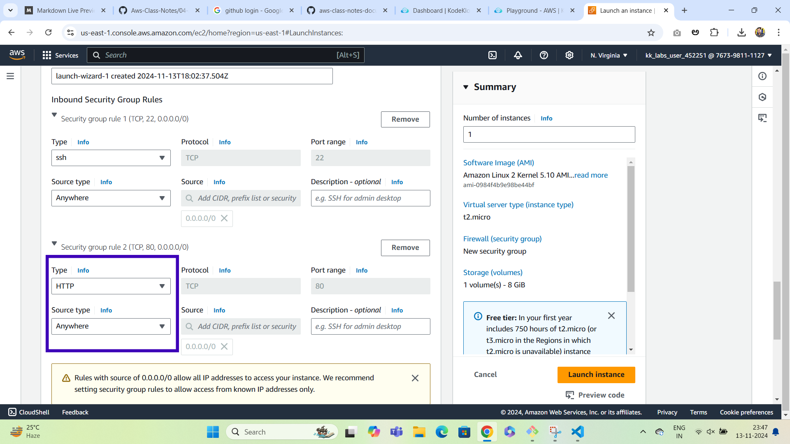

**click on advanced settings and give user data**
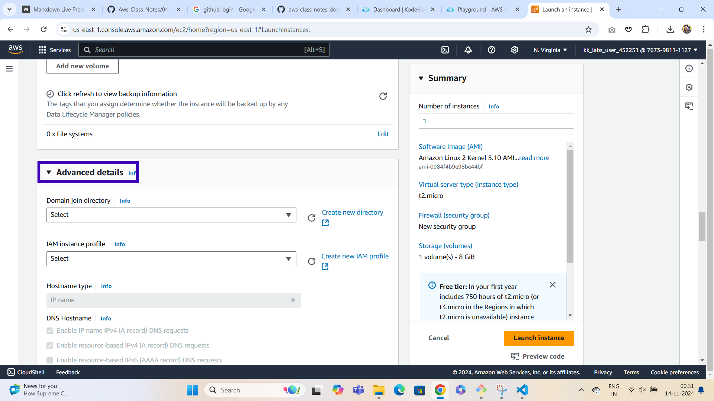

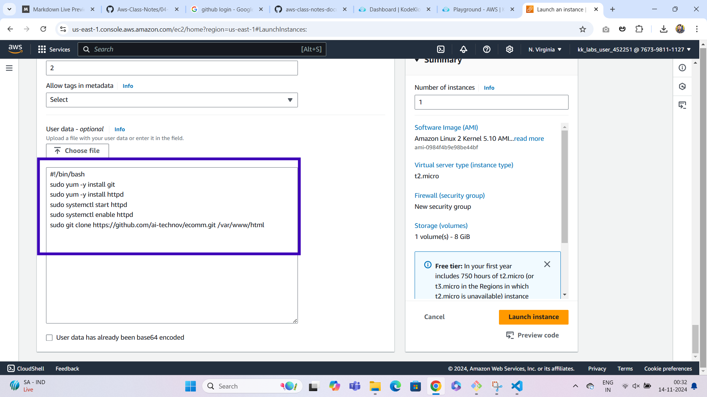

**click on launch instance as shown below**

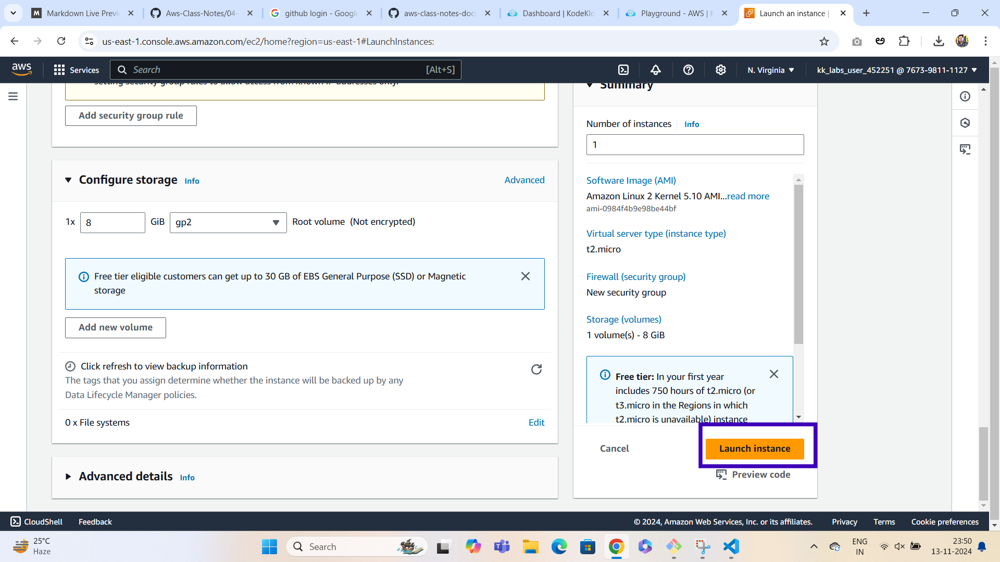

**click on the instanceid as shown below**

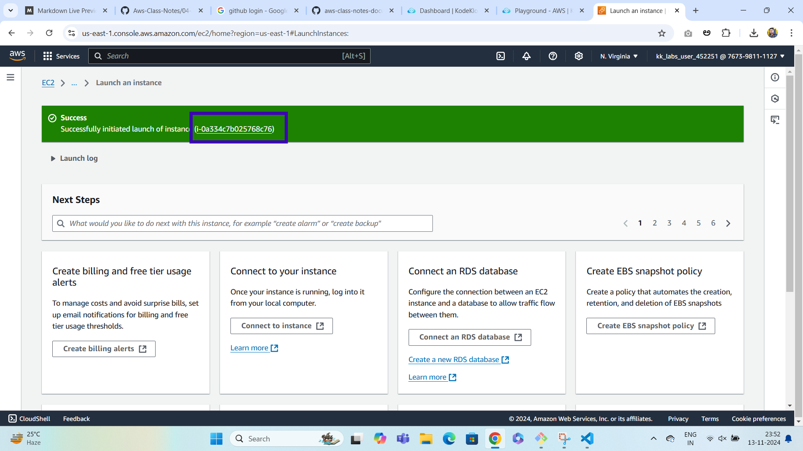

**select the instance and copy public ip address**

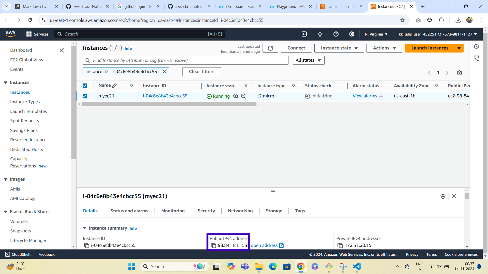

**if you paste the public ip address in the browser website will be displayed**

